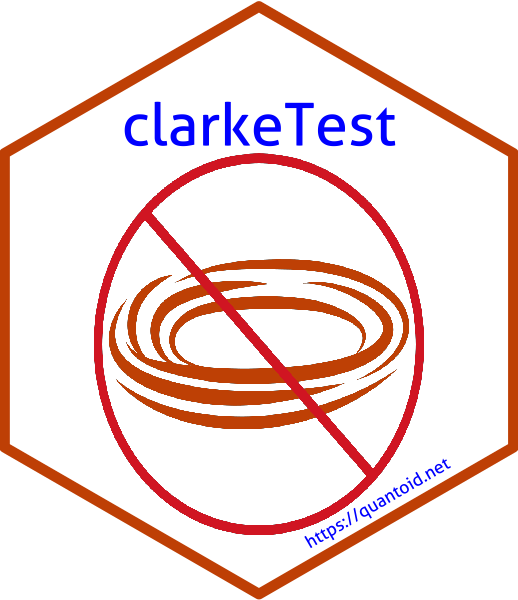

<!-- README.md is generated from README.Rmd. Please edit that file -->

# clarkeTest 

ClarkeTest makes doing tests of non-nested models easy and clear. The
main testing function currently supports models of class `lm`, `glm`
(binomial, poisson and negative binomial), `polr`, `clm`, `multinom`,
`mlogit`.

The initial code came from the
[`games`](https://github.com/brentonk/games) package which worked with
strategic game models as well as binomial GLMs and linear models. The
impetus for making this package was to extend the classes of models that
could be evaluated.

I re-wrote the function to call generic functions for the individual
log-likelihoods and the number of model parameters. This makes it easy
for others to extend the functionality by writing `indivLogLiks` and
`nparams` methods for a new model class.

  - The `indivLogLiks` function should take the model object as its only
    argument and return a vector of the individual log-likelihoods for
    each observation in the estimation sample. Here is an example for
    objects of class `clm`.

<!-- end list -->

``` r
indivLogLiks.clm <- function(model){
  probs <- predict(model, type="prob")$fit
  ans <- log(probs)
  return(ans)
}
```

  - The `nparams` function should take the model object as its only
    argument and return a scalar that gives the number of parameters in
    the model. Here is an example for models of class `clm`.

<!-- end list -->

``` r
nparams.clm <- function(model){
  length(coef(model))
}
```

  - Additionally, the function uses the `nobs()` generic to find the
    number of observations. If there is no `nobs()` method for the
    current model class, the user would have to write one of those, too.
    Here is an example of the `nobs` method for `mlogit` objects.

<!-- end list -->

``` r
nobs.mlogit <- function(object, ...){
  length(object$fitted.values)
}
```

## Installation

``` r
# Install release version from CRAN
install.packages("clarkeTest")
# Install development version from GitHub
remotes::install_github("davidaarmstrong/ClarkeTest")
```

## Usage

Here is an example of how the function works:

``` r
library(clarkeTest)
data(conflictData)
lm1 <- lm(riots ~ log(rgdpna_pc) + log(pop*1000) + 
    polity2, data=conflictData)
lm2 <- lm(riots ~ rgdpna_pc + pop + 
    polity2, data=conflictData)
clarke_test(lm1, lm2)
#> 
#> Clarke test for non-nested models
#> 
#> Model 1 log-likelihood: -8446
#> Model 2 log-likelihood: -8433
#> Observations: 4381
#> Test statistic: 1830 (42%)
#> 
#> Model 2 is preferred (p < 2e-16)
```
